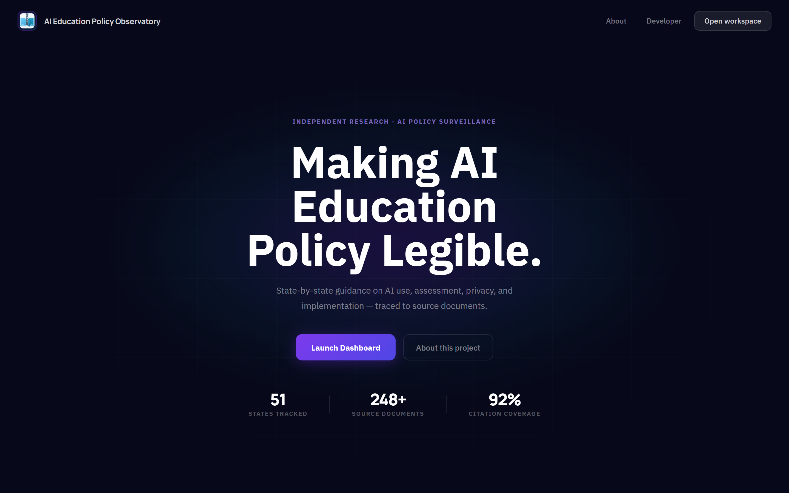
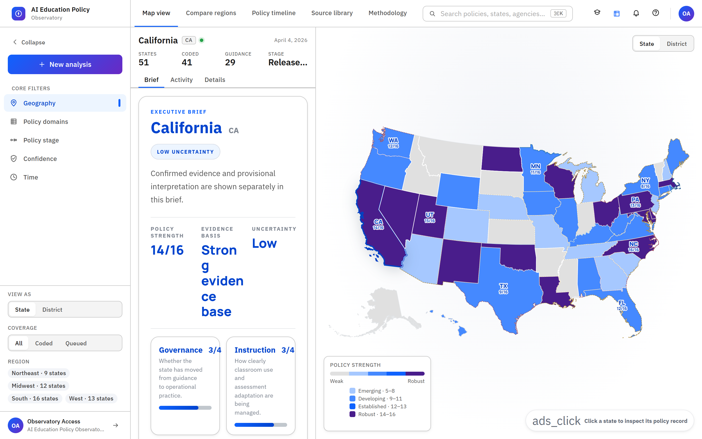
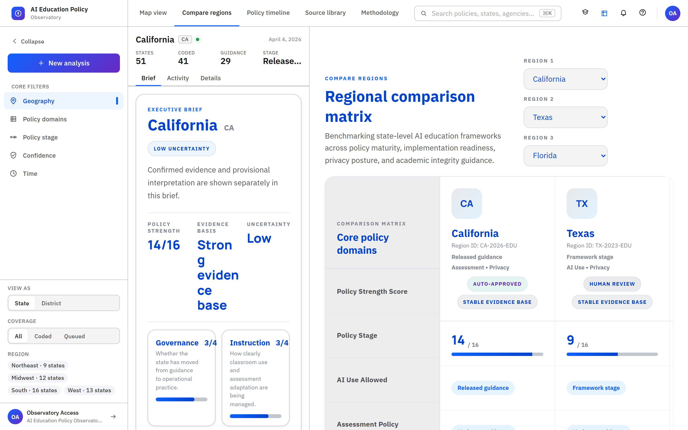
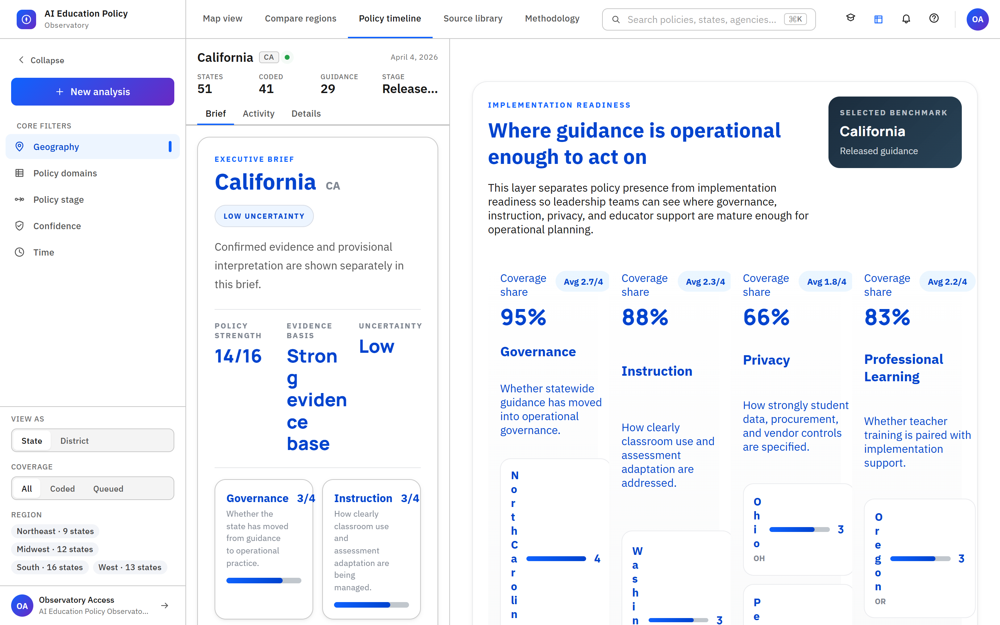
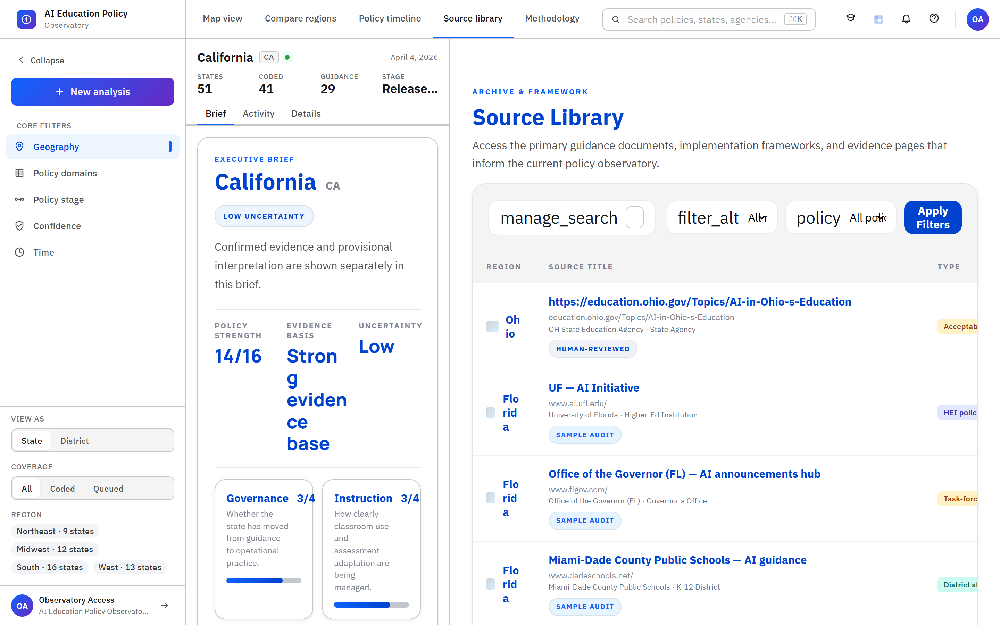
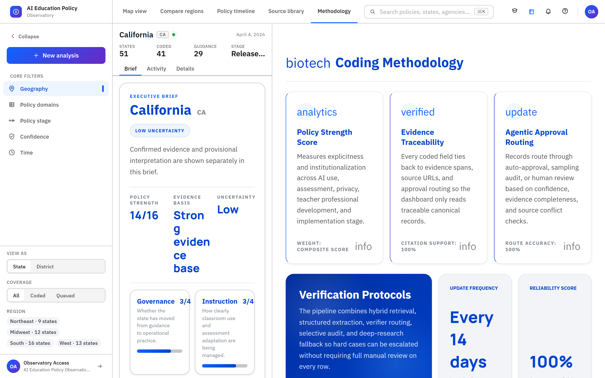
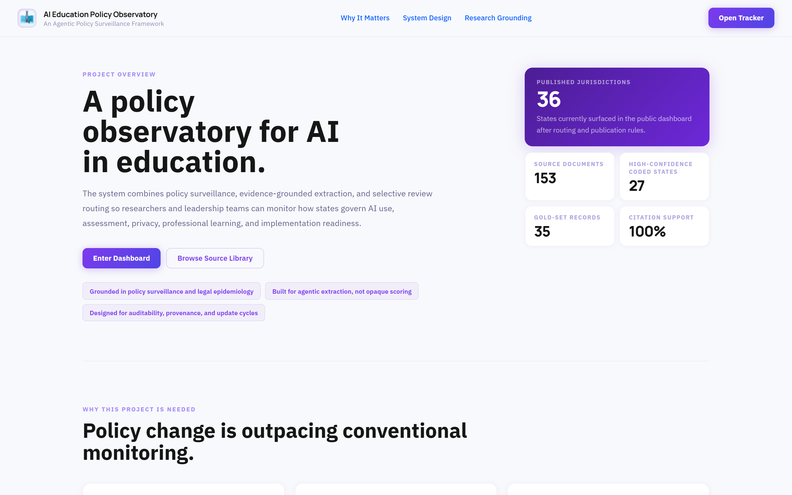

<p align="center">
  
</p>

# AI Education Policy Observatory

<p align="center">
  
  
  
</p>

Evidence-grounded observatory for tracking AI-in-education guidance across U.S. states.

Brand assets for deployment and sharing live in [`public/app-icon.svg`](./public/app-icon.svg), [`public/icon-192.png`](./public/icon-192.png), [`public/icon-512.png`](./public/icon-512.png), and [`public/social-preview.png`](./public/social-preview.png).

## Preview

The dashboard runs on an IBM-Carbon-derived design system (IBM Plex Sans, Carbon swatch palette, productive sidebar layout). Screenshots regenerate via `node scripts/capture-ui-screenshots.mjs` against a running dev server.

<p align="center">
  
</p>

<p align="center">
  
</p>

<p align="center">
  
</p>

<p align="center">
  
</p>

<p align="center">
  
</p>

<p align="center">
  
</p>

<p align="center">
  
</p>

## What it is

This project turns fragmented guidance pages, PDFs, implementation memos, and related policy artifacts into inspectable state-level records for leadership, policy analysis, and longitudinal monitoring.

## Included in this prototype

- State tile map with policy-strength coloring
- Filterable row-based tracker table
- Detail panel for coded policy dimensions
- Demo dataset that can be replaced with real coded policy records
- Crawling and canonical-data scaffolding scripts
- Architecture, SQL schema, and agent-role docs for a hybrid swarm + RAG pipeline
- Approval routing, deep research fallback, and evaluation scaffolding
- Landing page, project overview, live event layer, and branded observatory assets

## Suggested next steps

1. Replace demo rows with official coded state snapshots.
2. Add `source_url`, `source_date`, and `coder` fields from your real codebook.
3. Add district-level rows keyed by NCES district ID.
4. Swap the tile map layer with real GeoJSON once the row schema stabilizes.
5. Move from scaffolded records to extracted and reviewed canonical records.

## Run

```bash
npm install
npm run dev
```

## Data pipeline

```bash
npm run crawl:sources
npm run pipeline:import:docx -- --path "C:\path\to\file.docx" --state NC --state-name "North Carolina" --agency "North Carolina Department of Public Instruction" --title "Guidebook Title"
npm run pipeline:chunk
npm run pipeline:extract:auto
npm run pipeline:route
npm run pipeline:validate
npm run pipeline:verify:gemini
npm run pipeline:deep-research
npm run pipeline:evaluate
npm run pipeline:review-queue
npm run pipeline:publish
```

## Key files

- `docs/ARCHITECTURE.md`
- `docs/DEEP_RESEARCH.md`
- `docs/RESEARCH_DESIGN.md`
- `docs/CODEBOOK.md`
- `docs/EVALUATION_PLAN.md`
- `docs/IMPLEMENTATION_PLAN.md`
- `config/agent-roles.json`
- `config/approval-policy.json`
- `sql/policy_surveillance_schema.sql`
- `data/canonical/policy-records.schema.json`
- `data/gold-set/policy-records.gold.schema.json`
- `docs/GEMINI.md`
