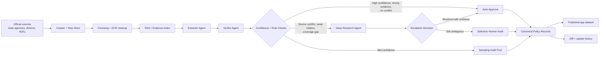

# AIED Policy Atlas Architecture

This project is designed as a `policy surveillance` pipeline first and a dashboard second.

## Core principle

The app should never read raw crawler output or unchecked LLM output directly.

Instead, the system should flow through:

1. `source registry`
2. `raw document store`
3. `evidence index / RAG corpus`
4. `structured extraction`
5. `verification`
6. `deep research fallback`
7. `selective human audit`
8. `canonical policy records`
9. `UI publish`

## Why this design

- Policy surveillance research emphasizes standardized coding, reproducibility, and comparable jurisdiction-level observations.
- RAG is best used as an evidence retrieval layer, not as the final database.
- Multi-agent orchestration is helpful for scale, but canonical records must remain traceable to evidence.
- Human oversight should be `human-on-the-loop`, not `human-in-the-loop` for every record.
- Deep research is best used as an escalation layer for difficult discovery and conflict resolution, not as the primary ETL path.

## System diagram

## Runtime layers

### 1. Collection layer

- `data/source-seeds.json`
- `data/generated/raw/*.html`
- `data/generated/policy-source-manifest.json`

### 2. Evidence layer

This is where future embeddings and chunk references should live.

Suggested artifacts:

- `data/generated/chunks.jsonl`
- `data/generated/embeddings/`
- `data/generated/retrieval-index/`
- `data/generated/retrieval-index.json`

### 3. Canonical layer

- `data/canonical/policy-records.json`
- `data/canonical/review-queue.json`
- `data/canonical/policy-records.schema.json`

### 4. Presentation layer

- React dashboard in `src/`
- Only reads validated canonical records

## Swarm roles

Recommended agent roles:

1. `scout`
   Finds or updates official source URLs.

2. `retriever`
   Fetches HTML/PDF and normalizes text.

3. `extractor`
   Produces structured JSON fields from evidence.

4. `verifier`
   Checks evidence spans, contradictions, missing values, and confidence.

5. `deep_research`
   Investigates unresolved jurisdictions, source conflicts, or citation gaps using high-context browsing and synthesis.

6. `publisher`
   Writes canonical records, diffs versions, and updates app-facing data.

## Approval policy

The operating model should be:

- `auto-approve`
  High confidence, strong evidence support, and no unresolved conflicts.
- `sample-audit`
  Mid-confidence records are published but sampled for periodic audit.
- `human-review`
  Low-confidence records, citation gaps, or conflicting official sources.

This keeps routine operations agentic while preserving evaluation-grade quality control.

## Design constraints

- Every coded field should trace back to one or more evidence spans.
- Every policy record should be versioned.
- Parent-child jurisdiction relationships should be explicit.
- Updates should be additive and reviewable, not destructive.
- Human reviewers should not be required for every record in routine operation.
