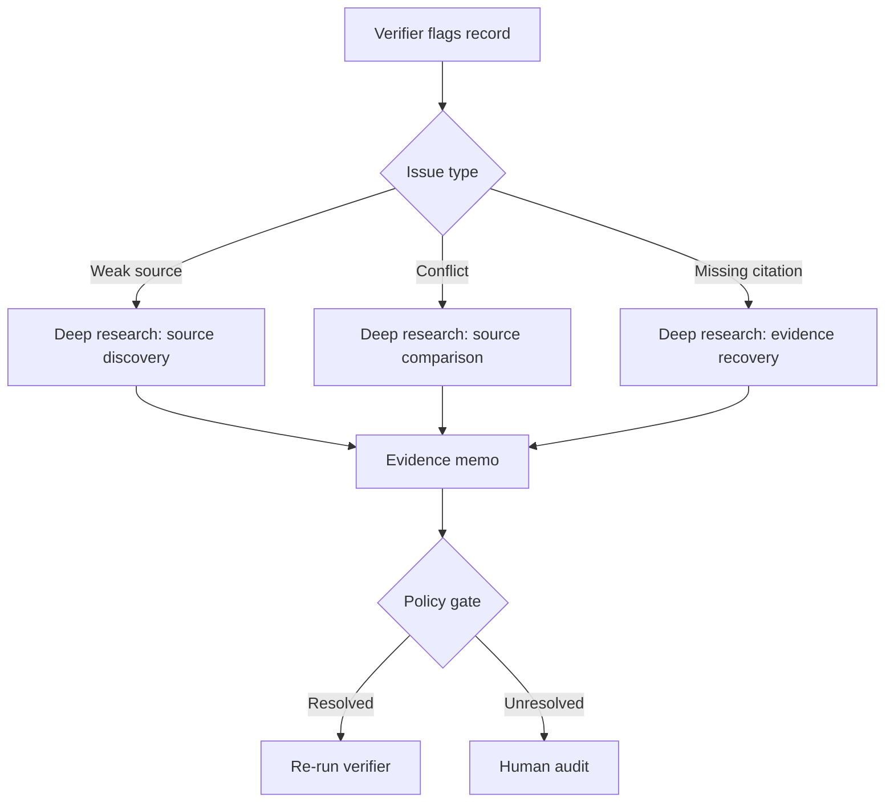

# Deep Research Role

This project uses `deep research` as a high-cost, high-context escalation agent.

It should not replace the core extraction pipeline. It should strengthen the pipeline when routine crawling, retrieval, and verification are not enough.

## When to invoke deep research

Invoke deep research only when one or more of these conditions are true:

1. The crawler found weak or incomplete official sources.
2. The verifier detected source conflict.
3. A record is missing direct citations for one or more coded fields.
4. A jurisdiction has only secondary references or press coverage.
5. A refresh run suggests a policy update but no stable replacement document has been found.

## What deep research should do

- Search for stronger official sources.
- Compare multiple candidate sources and identify the most authoritative one.
- Produce a concise evidence memo with direct links.
- Recommend whether a record is ready for auto-approval, sample audit, or human review.
- Surface update deltas when a policy appears to have changed over time.

## What deep research should not do

- Directly overwrite canonical policy records.
- Publish records without passing verification rules.
- Act as the only source of truth for routine extraction.
- Approve records with missing evidence spans.

## Recommended prompt contract

Deep research output should return:

- `jurisdiction_id`
- `investigation_reason`
- `candidate_sources`
- `recommended_primary_source`
- `field_level_evidence`
- `conflicts_found`
- `approval_recommendation`
- `open_questions`

## Integration pattern

## Research value

This makes deep research measurable as an intervention:

- Does it improve source discovery recall?
- Does it increase citation support rate?
- Does it reduce human review volume?
- Does it improve update detection accuracy?
